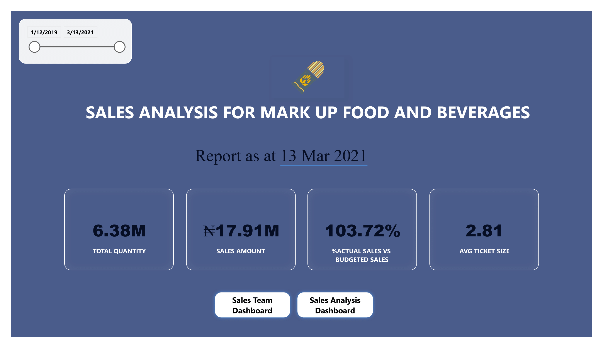

# Adebowale-Sagbele-Portfolio
Analytics Portfolio

# [Project 1: Customer Profiling Using Cluster Analysis](https://github.com/vsthepen/Telecomms-Dashboard)

This analytics project was imperative for stakeholders of ABC Telecomms to support their revenue drive and marketing effort. They wanted to have a better understanding of their customers, especially with regards to how they use their Internet Data Plans.
The company provided 6 months of customer data for profiling before further analysis.

First step:  I imported and cleaned the data contained in an excel workbook via power query editor in power bi. Unwanted columns, empty cells and redundant data were eliminated. Also, data types for each column were validated to maintain accuracy.

Second step: Normalized the data and established relationships between the fact and dimension tables using the customer number as the unique key.

Third step: Loyalty scores were assigned to each customer based on Data Subscribed and Bonus usage. Using on the customers final score, customers were classified into the following:
- Tier 1 Priority Service – Above 85% 
- Tier 2 Priority Service – Between 75% and 85%
- Tier 3 Priority Service + Incentives – Above 60% and less than 75%
- Tier 4 Priority Marketing + Incentives – Less than or equal to 60% 

In addition, key measures including Total number of customers, Total Assigned score, % Assigned score, Customer Group were created using Dax formulas.

Fourth step: A dynamic dashboard was created showing the 4 customer tiers with the aid of a bar chart, which is a great choice for visualizing data with less than 5 categories. I also utilized the format and customized tool tips options within Power Bi to give my dashboard a very professional face lift.

# Front page of the dashboard

# Challenges Encountered
1. Assigning customer group/tier to each customer based on their final score.
- SOLUTION: I joined the power Bi community online where I was guided on how to use the SWITCH function.

2. Some customers subscribed for data multiple times in a month, therefore the data subscribed & bonus used for that month had to be summed into one row and grouped into one Customer Number.
- SOLUTION: I did some research online and eventually spoke to a colleague who told me about the “group by” function in power query.

